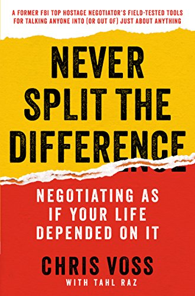
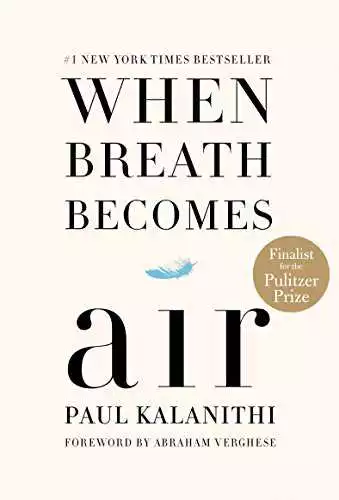

This week I was thinking that it would be fun to have a place to share my book reviews for the books I have completed this year. But here's the catch: _there will be a limitation of three sentences_.

## Books I Have Read in 2019

## Never Split the Difference

by Chris Voss

Learn how to negotiate any situation from an FBI hostage negotiator. Each chapter is filled with gripping stories from Chris's work in the field and gives you tactical advice on the art and science of negotiation. This book breaks down the theory and tools that can help you in negotiating a salary, purchasing a car, or working out some problems at home.

[eBook](https://smile.amazon.com/Never-Split-Difference-Negotiating-Depended-ebook/dp/B014DUR7L2/ref=sr_1_1?keywords=chris+voss&qid=1549924450&s=gateway&sr=8-1)

## When Breath Becomes Air

by Paul Kalanithi

A neurosurgeon with a brilliant future finds out he has terminal cancer in his thirties. In this unfinished memoir, he must find out what is truly important in life while facing death. This book is gut-wrenching, thought-provoking, and teaches us about how to live.

[eBook](https://smile.amazon.com/When-Breath-Becomes-Paul-Kalanithi-ebook/dp/B00XSSYR50/ref=sr_1_1?ie=UTF8&qid=1551121182&sr=8-1&keywords=when+breath+becomes+air)

