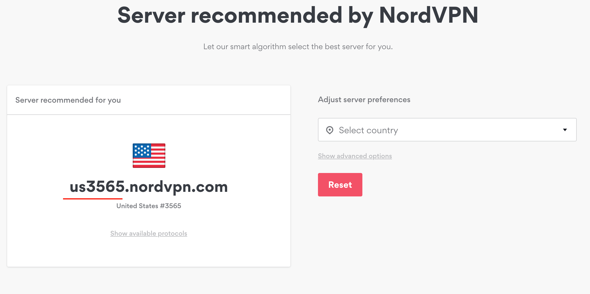

## Motivation

The world wide web is a dark and scary place and if you want to protect your privacy and resist the man than a VPN(Virtual Private Network) may be for you.

Some Benefits that a VPN provides are:

- Anonymity
- Overcoming Geo-Location challenges
- Increased Security

I was not happy when I got a slap on the wrist from my ISP saying that I had made a copyright infringement and to _cut it out_.

> If you have been copying, sharing, or otherwise using copyrighted content without the copyright owner's permission using your Internet service, we recommend you stop doing it immediately.

✊ They had my ip address and everything so it was time to fight back.

Here are some good articles on _why you may need want a VPN_.

- [TunnelBear](https://www.tunnelbear.com/blog/always-use-a-vpn/)
- [Mashable](https://mashable.com/article/why-you-need-vpn/)
- [How-To-Geek](https://www.howtogeek.com/133680/htg-explains-what-is-a-vpn/)

## VPN Options

I started researching VPN options and found of a few subreddits of people raving about a few VPN providers.

**Nord VPN** had been a stand out from this [sub-reddit](https://www.reddit.com/r/VPNTorrents/comments/as2cgo/whats_the_best_vpn_for_torrenting/).

[PC Mag](https://www.pcmag.com/roundup/354396/the-best-vpns-for-bittorrent) also did a great article comparing the major VPN.

[BearTunnel](https://thewirecutter.com/reviews/best-vpn-service/) even won best VPN on wirecutter.com for best VPN service.

After researching several options I ended up choosing **NordVPN**:

- 🇵🇦based in Panama
- 🌱[tons of servers](https://nordvpn.com/servers/tools/)
- ☠️[killswitch feature](https://nordvpn.com/features/kill-switch-technique/)
- 🐧[linux client](https://support.nordvpn.com/Connectivity/Linux/1325531132/Installing-and-using-NordVPN-on-Debian-Ubuntu-and-Linux-Mint.htm)
- 💪[wireguard support](https://nordvpn.com/blog/nordlynx-protocol-wireguard/)
- 🎅has an amazing sale going on

## Setup

This guide is for **Ubuntu 18.04** and **NordVPN** but should work for any Debain-based system.

After you have signed up for your VPN, make sure you have your credentials handy. You will need them soon.

First thing you do is pull down the latest NordVPN file from their site.

1. You'll want to be somewhere like your Downloads directory.

   ```bash

   cd ~/Downloads

   ```

1. Pull down the file from NordVPN.

   ```bash

   sudo wget -qnc https://repo.nordvpn.com/deb/nordvpn/debian/pool/main/nordvpn-release_1.0.0_all.deb

   ```

1. More linux magic.

   ```bash

   sudo dpkg -i ./nordvpn-release_1.0.0_all.deb

   ```

1. Next, update your package list.

   ```bash

   sudo apt update

   ```

1. Now install NordVPN.

   ```bash

   sudo apt install nordvpn

   ```

1. (optional) If this step doesn't work for you*(like in my situation)*, try this:

   ```bash

   sudo wget https://repo.nordvpn.com/gpg/nordvpn_public.asc -O - | sudo apt-key add -

   sudo apt install nordvpn

   ```

Now you should access to `nordvpn` command!

## Configuration

Now that you are setup with NordVPN, let's set some good default settings.

1. First step is to login with your NordVPN credentials.

   ```bash

   nordvpn login

   ```

1. Once your logged in, connect to a generic server.

   ```bash

   nordvpn connect(c)

   ```

   If you want to configure to a specific server, check out there [server list](https://nordvpn.com/servers/tools/).
   <br/><br/>
   

1. In my example, server `us3565` was the server recommended for my location. To connect with this specific server run:

   ```bash

   nordvpn connect us3565

   ```

1. To confirm that you are connected

   ```bash

   nordvpn status

   ```

1. When you are ready to disconnect

   ```bash

   nordvpn disconnect(d)

   ```

## Advanced Configuration

## Conclusion

## Resources

- [NordVPN Ubuntu Guide](https://support.nordvpn.com/Connectivity/Linux/1325531132/Installing-and-using-NordVPN-on-Debian-Ubuntu-and-Linux-Mint.htm)
- [NordVPN Server List](https://nordvpn.com/servers/tools/)
- [What's My IP]()
